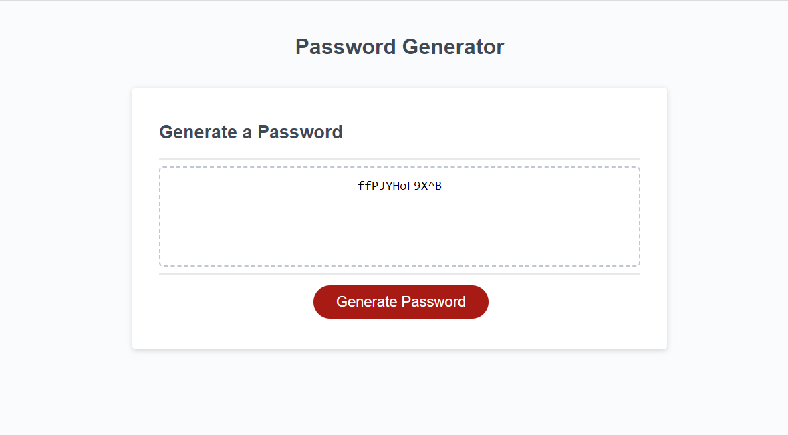

# HW-Challenge-3

## Description

Our objective this assignment was to modify and create code that generates a random password based on selected criteria.

Main Objectives: 

- when the generate button is clicked a prompt shows up
- the prompt logs the number of digits entered by the user or notifies them if the user has selected too few or too many digits
- user is asked to confirm if they want uppercase, lowercase, numbers and/or special characters in their password
- confirms log the selections made by the user based on character type
- a random password is generated based on the selected criteria

## Links

Application: https://pg1219.github.io/HW-Challenge-3/

Repo: https://github.com/pg1219/HW-Challenge-3

## Mock-Up

Preview image of deployed application

